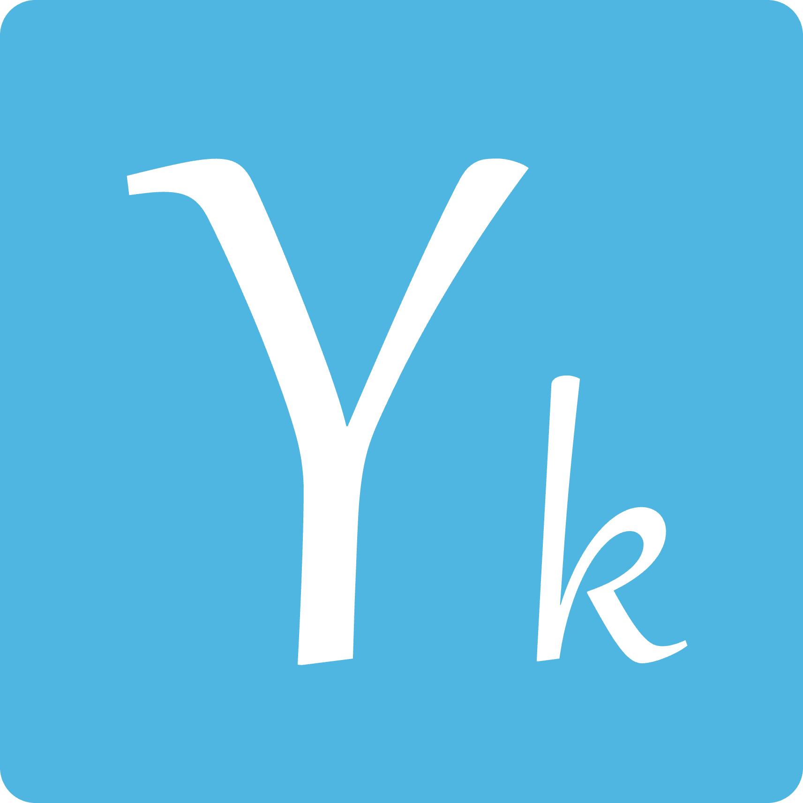

# youthKit 组件库

> 一套轻量级的 Vue3 组件库开发框架

## Technology stack

`Vue3`: 按需编译 => 更小的体积; 响应式提升+算法优化 => 更快的相应性能; Composition Api => 高内聚低耦合

`Vite`: esbuild => 预构建依赖; 原生 ESM => 加速 HMR; 预配置 => 开箱即用

`TypeScript`: 类型定义 => 可读性 + 可维护性; 静态类型检查 => 代码可控

  

  

  

## Highlights

✨ 全面拥抱 Vue3 + TypeScript, 更好的开发体验 Keep up with The Times!

✨ 使用 f2elint, 配置简单 & 规约全面, 集成了 eslint, husky 等工具

✨ 命令式创建组件模板, 风格统一, yarn gen 一下方便开发

✨ 交互式文档站, 在 Vue 页面中直接导入 Markdown 文件作为组件

✨ 完备的单元测试, 使用 Jest 实现

✨ 支持全局调用 & 按需加载

...

## Todo

🎈 统一组件风格, 完备组件数量

🎈 发布 npm 包

🎈 更好的自动化流程(CI/CD)

...
